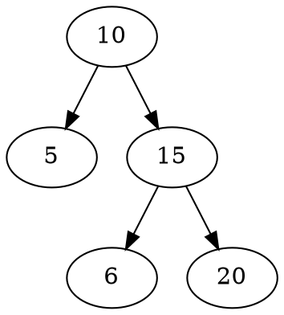
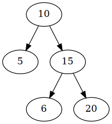

<div align="center">

# lctree :seedling:

lctree provides a CLI and Golang primitives to serialize and deserialize [LeetCode binary trees](https://support.leetcode.com/hc/en-us/articles/360011883654-What-does-1-null-2-3-mean-in-binary-tree-representation) (e.g. "[5,4,7,3,null,2,null,-1,null,9]").

[Overview](#overview)&nbsp;&nbsp;&nbsp;|&nbsp;&nbsp;&nbsp;[Getting Started](#getting-started)&nbsp;&nbsp;&nbsp;|&nbsp;&nbsp;&nbsp;[Contributing](#contributing)&nbsp;&nbsp;&nbsp;

[](https://pkg.go.dev/github.com/sbourlon/go-lctree?tab=doc) [](https://goreportcard.com/report/github.com/sbourlon/go-lctree) [](https://coveralls.io/github/sbourlon/go-lctree?branch=master) [](https://travis-ci.org/sbourlon/go-lctree)

</div>

## Overview
- Deserialize/Serialize
- Walk Depth-First
- Walk Breadth-First
- Convert to [DOT language](https://graphviz.gitlab.io/_pages/doc/info/lang.html) for visualization
- CLI (see [bin/](bin/))

## Getting Started
### Deserialize
```golang
package main

import (
	"fmt"

	"github.com/sbourlon/go-lctree"
)

// Type alias
type TreeNode = lctree.TreeNode

func mySolution(root *TreeNode) {
	fmt.Printf("root: %+v\n", root)
	return
}

func main() {
	tree := lctree.Deserialize("[1,null,2,3]")
	mySolution(tree)
}
```
Output:
```
root: &{Val:1 Left:<nil> Right:0xc00008e020}
```

### Serialize
```golang
package main

import (
	"fmt"

	"github.com/sbourlon/go-lctree"
)

type TreeNode = lctree.TreeNode

func mySolution() *TreeNode {
	return lctree.Deserialize("[1,null,2,3]")
}

func main() {
	tree := mySolution()
	fmt.Println(lctree.Serialize(tree))
}
```
Output:
```
[1,null,2,3]
```

### Walk Depth-First
```golang
package main

import (
	"fmt"

	"github.com/sbourlon/go-lctree"
)

type TreeNode = lctree.TreeNode

func mySolution() *TreeNode {
	return lctree.Deserialize("[1,null,2,3]")
}

func main() {
	tree := mySolution()

	walkFn := func(n *TreeNode) error {
		fmt.Printf("%+v\n", n)
		return nil
	}

	tree.WalkDepthFirst(walkFn)
}
```
Output:
```
&{Val:1 Left:<nil> Right:0xc00000c0a0}
&{Val:2 Left:0xc00000c0c0 Right:<nil>}
&{Val:3 Left:<nil> Right:<nil>}
```

### Walk Breadth-First
```golang
package main

import (
	"fmt"

	"github.com/sbourlon/go-lctree"
)

type TreeNode = lctree.TreeNode

func mySolution() *TreeNode {
	return lctree.Deserialize("[1,null,2,3]")
}

func main() {
	tree := mySolution()

	walkFn := func(n *TreeNode, depth int) error {
		fmt.Printf("depth: %d\t%+v\n", depth, n)
		return nil
	}

	tree.WalkBreadthFirst(walkFn)
}
```
Output:
```
depth: 0        &{Val:1 Left:<nil> Right:0xc00000c0a0}
depth: 1        <nil>
depth: 1        &{Val:2 Left:0xc00000c0c0 Right:<nil>}
depth: 2        &{Val:3 Left:<nil> Right:<nil>}
depth: 2        <nil>
depth: 3        <nil>
depth: 3        <nil>
```

### Convert to DOT language for visualization
```golang
package main

import (
	"fmt"

	"github.com/sbourlon/go-lctree"
)

type TreeNode = lctree.TreeNode

func mySolution() *TreeNode {
	return lctree.Deserialize("[10,5,15,null,null,6,20]")
}

func main() {
	tree := mySolution()
	fmt.Println(tree.DOT())
}
```
Output:


then convert into a png picture (e.g. tree.png):
```
$ dot -Tpng -o tree.png tree.dot
```
Output:



## Contributing
Pull-requests, feature requests and issues are welcome.

## License
[ISC license](LICENSE.md)
